# boomstick
Boomsticks is a Minetest modpack that adds weapons as well as an API. This mod started out as a fork of one of my favorite Minetest mods, [rangedweapons](https://github.com/daviddoesminetest/rangedweapons), but ended up turning into a complete re-write from scratch. It heavily draws inspiration from rangedweapons and is intended to be a spritual successor. It borrows plenty from that mod, but also does a lot of things differently (especially under the hood in Lua). It isn't meant to necessarily compete with rangedweapons, rather its just my own take on what my ideal weapons mod would look like.

- [Features](#features)
- [User Manual](#user-manual)
  - [Items](#items)
  - [Nodes](#nodes)
- [API Reference](#api-reference)
- [Licensing](#licensing)
- [To-Do](#todo)

## Features
Boomstick has some compelling features:
- **Detailed crafing and weapon mechanics**
  - Recipes for ammo and weapons crafting require a variety of metals, alloys, and intermediary weapon parts.
  - Weapons need to be reloaded, cocked or cycled to fired, and generate recoil.
  - Projectiles are entity-based with velocity and gravity, not hitscans.
- **New blocks**
  - The **Target Node** plays a noise when hit by a projectile.
  - The **Anti-Gun Node** disables the use of weapons within a 10-block radius, just like with [rangedweapons](https://github.com/daviddoesminetest/rangedweapons).
  - The **Bullet Maker** is a specialized crafting bench that turns raw materials like brass and lead into usable components for crafting ammunition.
- **Mod API**
  - Allows modders to create their own weapons or weapons mods. The API is documented thoroughly [here](#api-reference). The default weapons included in Boomstick are implemented using nothing but the API and can also serve as a great reference.
- **Localization support**
  - Built-in localization support. **Translators needed!**
- **No required dependencies**
  - Can run without any dependencies if necessary, **although you will need [Technic](https://github.com/minetest-mods/technic) and [Basic Materials](https://github.com/mt-mods/basic_materials) in order to craft most items**.
- **User Guide**
  - A lot of Minetest mods give players no instruction on how their mod actually works. Boomstick aims to be extremely well-documented, both for players and modders.

## User Manual

### Crafing Items

| Item               | Icon                                                                       | Description                                                                                                        | Recipe                                                          |
|--------------------|----------------------------------------------------------------------------|--------------------------------------------------------------------------------------------------------------------|-----------------------------------------------------------------|
| Low-Grade Powder   |   | Basic powder used by simplistic early-game weapons such as muskets.                                                |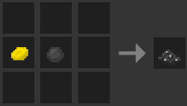 |
| High-Grade Powder  | 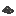 | Advanced powder used by all late-game weapons.                                                                     |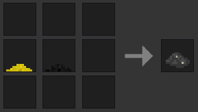|
| Trigger            |            | Trigger used in almost all weapons.                                                                                |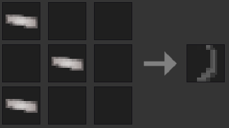           |
| Wrought Iron Long Barrel |      | Used for crafting early-game rifles like muskets.                                                                                |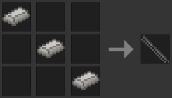           |
| Wrought Iron Short Barrel |      | Used for crafting early-game pistols like the musket pistol.                                                                                |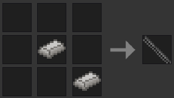           |
| Cast Iron Long Barrel |      | Used for crafting mid-game rifles and shotguns.                                                                                |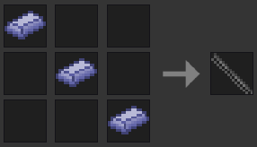           |
| Cast Iron Short Barrel |      | Used for crafting mid-game pistols.                                                                                |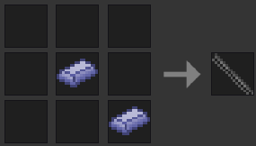           |
| Stainless Steel Long Barrel |      | Used in crafting modern rifles and shotguns.                                                                                |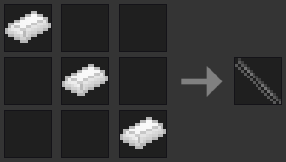           |
| Stainless Steel Short Barrel |      | Used in crafting modern pistols and SMGs.                                                                                |           |

### Weapons

| Item   | Icon                                                                                  | Description                                                                                                        | Recipe                                                |
|--------|---------------------------------------------------------------------------------------|--------------------------------------------------------------------------------------------------------------------|-------------------------------------------------------|
| Rustington |        | Pump-action shotgun with a 5-round capacity.                                                                       |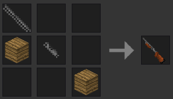      |

### Nodes
| Item   | Icon                                                                                  | Description                                                                                                        | Recipe                                                |
|--------|---------------------------------------------------------------------------------------|--------------------------------------------------------------------------------------------------------------------|-------------------------------------------------------|
| Target Node |              | Makes a "ding" when shot.                                                                                          |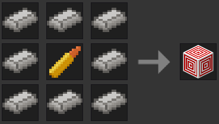      |
| Anti-Gun Node | 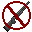          | Prevents the use of any Boomstick weapons within a 10-node radius.                                                 |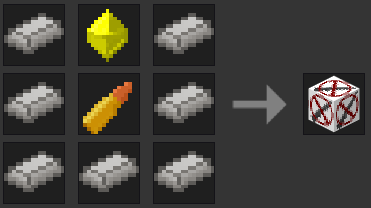      |
| Bullet Maker | 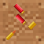          | Allows the crafting of ammunition.                                                                 |      |

## API Reference

## Licensing

### Code

All code in this project is licensed under the GNU LGPL-2.1.

Any piece of media not listed here is either original work that is licensed under CC0, or is from the excellent [rangedweapons](https://github.com/daviddoesminetest/rangedweapons) mod.

### Assets
| File                                                                                                                           | License                                                                                                                                                             |
|--------------------------------------------------------------------------------------------------------------------------------|---------------------------------------------------------------------------------------------------------------------------------------------------------------------|
| [boomstick_projectile_pellet](https://opengameart.org/content/cannonball)                                                      |  [CC-0](https://creativecommons.org/publicdomain/zero/1.0/)    |
| [Grenade Texture](https://opengameart.org/content/16x16-grenades)                                                              |  [CC-BY-SA-4.0](https://creativecommons.org/licenses/by-sa/4.0/) |
| [boomstick_sulfur_lump.png](https://github.com/minetest/minetest_game/blob/master/mods/default/textures/default_coal_lump.png) |  [CC-BY-SA-4.0](https://creativecommons.org/licenses/by-sa/4.0/) |
| [boomstick_low_grade_powder.png](https://github.com/minetest/minetest_game/blob/master/mods/dye/textures/dye_dark_grey.png) |  [CC-BY-SA-4.0](https://creativecommons.org/licenses/by-sa/4.0/) |
| [boomstick_empty_2.ogg](https://freesound.org/people/JakLocke/sounds/412294/)                                                  |  [CC BY 3.0](https://creativecommons.org/licenses/by/3.0/)          |
| [boomstick_shotgun_fire.ogg](https://freesound.org/people/FilmmakersManual/sounds/522484/)                                     |  [CC-0](https://creativecommons.org/publicdomain/zero/1.0/)    |
| [boomstick_shotgun_load.ogg](https://freesound.org/people/FilmmakersManual/sounds/522288/)                                     |  [CC-0](https://creativecommons.org/publicdomain/zero/1.0/)    |
| [boomstick_revolver_load_1.ogg](https://freesound.org/people/Dredile/sounds/177863/)                                           |  [CC-0](https://creativecommons.org/publicdomain/zero/1.0/)    |
| [boomstick_shotgun_fire_2.ogg]()                                                                                               |                                                                                                                                                                     |
| [boomstick_shotgun_fire_3.ogg]()                                                                                               |                                                                                                                                                                     |
| [boomstick_revolver_load_2.ogg]()                                                                                              |                                                                                                                                                                     |
| [boomstick_revolver_load_3.ogg]()                                                                                              |                                                                                                                                                                     |
| [boomstick_revolver_load_4.ogg]()                                                                                              |                                                                                                                                                                     |
| [boomstick_revolver_load_5.ogg]()                                                                                              |                                                                                                                                                                     |
| [boomstick_revolver_empty_1.ogg](https://freesound.org/people/FilmmakersManual/sounds/522415/)                                 |  [CC-0](https://creativecommons.org/publicdomain/zero/1.0/)    |
| [boomstick_revolver_cock_1.oog](https://soundbible.com/1988-Gun-Cocking-Fast.html)                                             |  [CC-0](https://creativecommons.org/publicdomain/zero/1.0/)    |
| boomstick_ding.ogg[1](https://freesound.org/s/411089/) [2](https://freesound.org/s/127149/) | |
| boomstick_musket_charge.png[1](https://github.com/minetest/minetest_game/blob/master/mods/default/textures/default_paper.png) [2](https://opengameart.org/content/cannonball) [3](https://github.com/minetest/minetest_game/blob/master/mods/dye/textures/dye_dark_grey.png) | |

## To-Do:
- [ ] Add crafting recipes
  - [x] Add a long barrel crafting item + recipe
  - [x] Add a body crafting item + recipe
  - [x] Ammo recipes
  - [ ] Add target block recipe
  - [ ] Antigun block recipe
- [ ] Add knock-back when hit
- [ ] Smoke particles
- [ ] Doors and glass should break when fired at with certain weapons
- [ ] Emit a temporary light source upon firing (muzzle flash)
- [ ] Add settingtypes.txt for server owners
- [ ] Add weapon privilidges for server owners
- [ ] Add more weapons (revolver, rifle, etc)
